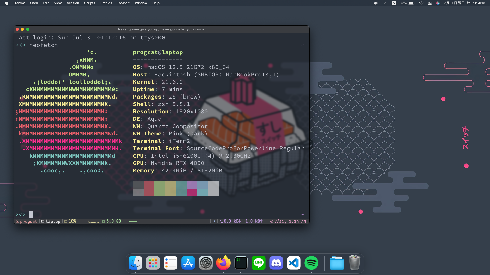

# NP900X3L-OpenCore-Monterey
macOS Monterey for My Samsung NP900X3L

## What works

* Keyboard & Touchpad
* iGPU
* Brightness Key (Instead of fn+F2 and fn+F3, it is Ctrl+F2 and Ctrl+F3)
* WiFi & Bluetooth
* Battery
* Audio (Speaker & mic)
* A virtual RTX4090 to boost your confidence!

## What not works

* Sleep

> If it works on your machine, please consider star this repo :D
